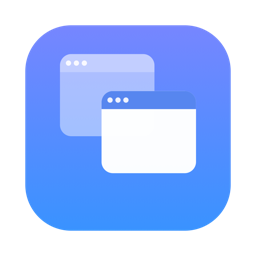

<p align="center">
  
</p>

<h1 align="center">Reborn</h1>

<p align="center">
  <strong>ウィンドウの配置を保存して、いつでも元通りに。</strong><br>
  複数モニター環境に対応した、ミニマルな macOS メニューバーアプリ。
</p>

<p align="center">
  <a href="https://github.com/den0206/reborn-releases/releases/latest"></a>
</p>

<p align="center">
  <!-- BEGIN:release-badge -->
  <a href="https://github.com/den0206/reborn-releases/releases/latest"></a>
  <!-- END:release-badge -->
  
  
  
  
  
</p>

<p align="center">
  <a href="README.md">English</a> · 日本語
</p>

<!-- BEGIN:latest-release -->
<p align="center">
  最新版: <strong>0.0.4</strong>（2026-08-10 公開）
</p>
<!-- END:latest-release -->

---

**Reborn** は、開いているアプリケーションウィンドウの位置・サイズ・モニター割り当てをまとめて保存し、
ワンクリックで元通りに復元する macOS メニューバー常駐アプリです。

> 「MacBook をデスクに戻したら、何もしなくても作業環境が元通りになる」

外部モニターを外して持ち出し、戻ってきてつなぎ直す。そのたびにウィンドウを並べ直す作業を、
**メニューバーから 1 クリック**（あるいはモニターを挿すだけ）で終わらせます。

**Reborn は完全無料です。** すべての機能を誰でも使えます。有料プラン・サブスクリプション・
アプリ内課金・試用期間はなく、課金で解放される機能もありません。
広告もトラッキングもなく、アカウント登録も不要です。
ネットワーク通信は、あなたが「アップデートを確認」または「アップデート」を押したときだけです。

このリポジトリは **配布用リリース（DMG）の置き場** です。アプリ本体のソースコードは別リポジトリで管理しています。

## 目次

- [できること](#できること)
- [クイックスタート](#クイックスタート)
- [使い方](#使い方)
- [機能一覧](#機能一覧)
- [設定](#設定)
- [マルチモニターの扱い](#マルチモニターの扱い)
- [アップデート](#アップデート)
- [アンインストール](#アンインストール)
- [料金について](#料金について)
- [プライバシーとセキュリティ](#プライバシーとセキュリティ)
- [制限事項](#制限事項)
- [トラブルシューティング](#トラブルシューティング)
- [バージョン表記について](#バージョン表記について)

## できること

- **配置の保存** — 現在開いているすべてのウィンドウの位置・サイズ・どのモニターにあるかを、名前を付けて保存します。最小化中のウィンドウも保存対象です。
- **1 クリック復元** — メニューバーの一覧から名前をクリックするだけで、保存した配置にウィンドウが戻ります。
- **自動復元** — モニターの抜き差しを検知し、その構成に一致するレイアウトを自動で適用します（既定 OFF）。
- **グローバルショートカット** — レイアウトごとにキーの組み合わせ（例: ⌃⌥⌘1）を割り当て、どのアプリからでも呼び出せます。
- **マルチモニター対応** — モニターは UUID で同定します。接続順や解像度が変わっても、正しいモニターへ相対位置を保って戻します。
- **配置プレビュー** — 設定画面で、保存済みレイアウトがどんな配置なのかをミニマップで確認できます。
- **クリーン復元** — 同じレイアウトをもう一度選ぶと、確認のうえでレイアウトに含まれないアプリを終了してから配置し直します（既定 OFF）。
- **除外アプリ / プライバシーモード** — 触ってほしくないアプリを対象外にしたり、ウィンドウタイトルを保存しない設定にできます。
- **書き出し / 読み込み** — レイアウトを `.rebornlayout` ファイルとして持ち出し・共有できます。

Dock にアイコンは出ません。常駐中はポーリングを一切行わず、アイドル時の CPU 使用率は 0% を目標に設計されています。

## クイックスタート

### 動作環境

| 項目 | 内容 |
|------|------|
| OS | **macOS 26 Tahoe 以降** |
| アーキテクチャ | Apple Silicon / Intel（Universal Binary） |
| 必要権限 | アクセシビリティ（必須）／通知（任意） |
| 依存 | なし（サードパーティライブラリ ゼロ） |

### インストール

1. [**Releases**](https://github.com/den0206/reborn-releases/releases/latest) から `Reborn-X.Y.Z.dmg` をダウンロードする
2. DMG を開き、`Reborn.app` を **`アプリケーション` フォルダにドラッグ**する
3. `アプリケーション` フォルダから Reborn を起動する

> **DMG から直接起動しないでください。**
> マウント中の DMG や外付けディスクから起動すると、そのパスがシステム設定の「ログイン項目」や
> 「メニューバーに追加することを許可」にリリースごとの行として残り続け、アプリ内アップデートも使えません。
> Reborn はこの状態を検知すると、起動時に `アプリケーション` フォルダへの移動を提案します。

### 初回起動

初回起動時にオンボーディングが表示され、**アクセシビリティ権限**を求められます。

他のアプリのウィンドウを移動・リサイズするために、macOS が必須としている権限です。
「システム設定 > プライバシーとセキュリティ > アクセシビリティ」で Reborn を許可すると、
オンボーディングが自動的に次のステップへ進みます。

Reborn が読み取るのは **ウィンドウの位置・サイズ・タイトル・最小化状態だけ**です。
ウィンドウの中身やキー入力には一切アクセスしません。

> **Gatekeeper の警告が出る場合**
> 配布 DMG は Developer ID で署名し、Apple の公証（Notarization）を通しています。
> それでも「開発元を確認できません」と表示されたときは、`Reborn.app` を右クリック →「開く」で
> 一度だけ許可してください。

## 使い方

メニューバーの ⧉ アイコン（`macwindow.on.rectangle`）をクリックするとポップオーバーが開きます。

### 配置を保存する

1. ウィンドウを好きなように並べる
2. メニューバーアイコン →「**＋ 現在の配置を保存**」
3. 保存対象のアプリ一覧がその場に表示されるので、名前を入力して **Enter**

デフォルト名はモニター構成と日付から作られます（例: 「2 モニター 2026-07-25」）。
同じ名前がすでにあるときは、末尾に番号が付いて一意になります（「作業」→「作業 2」）。

### 配置を復元する

一覧の**行をクリックするだけ**です。実行中は行にスピナー、完了すると ✓ が 1 秒表示されます。

復元は **best-effort** で動きます。1 つのウィンドウが復元できなくても処理は止まらず、
最後に「12 個のウィンドウを配置（2 件スキップ）」のようなサマリーが通知されます。

### レイアウトを管理する

| 操作 | 方法 |
|------|------|
| 今の配置で更新 | 行を右クリック →「今の配置で更新」（名前・ショートカットはそのまま） |
| 名前を変更 | 行を右クリック →「名前を変更」、または設定 > レイアウトでインライン編集 |
| 削除 | 行を右クリック →「削除」。⌘ を押しながらで確認をスキップ |
| 並べ替え | 設定 > レイアウトでドラッグ & ドロップ |
| 読み込み | `.rebornlayout` ファイルをポップオーバーにドラッグ & ドロップ |

### キーボード操作

| キー | 動作 |
|------|------|
| `↑` `↓` | 行を選択 |
| `Enter` | 選択中のレイアウトを復元 |
| `⌘⌫` | 選択中のレイアウトを削除 |
| `⌘,` | 設定を開く |
| `Esc` | ポップオーバーを閉じる |

### 行の見かた

- 行の左にある 🖥 の数が、そのレイアウトを保存したときの**モニター台数**です。
- 現在の構成と一致するレイアウトは、バッジが色付きで表示されます（＝今すぐ使える）。
- モニター台数が保存時と異なる行は**グレーアウト + ⚠️** になり、クリックできません。
  ツールチップに「保存時: 2 台 / 現在: 1 台」のように理由が出ます。

## 機能一覧

| 機能 | 概要 |
|------|------|
| レイアウト保存 | 全ウィンドウの位置・サイズ・モニター割当・最小化状態を名前付きで保存（最大 20 件） |
| レイアウト復元 | 保存した配置を適用。1 クリック／ショートカット／自動のいずれからでも |
| レイアウト管理 | 一覧・リネーム・上書き更新・削除・並べ替え |
| マルチモニター対応 | モニターを UUID で同定。構成が変わっても相対座標で安全に再配置 |
| 権限オンボーディング | アクセシビリティ権限の理由説明と、システム設定への誘導 |
| 自動復元 | モニター構成の変化を検知して、一致するレイアウトを自動適用（既定 OFF） |
| グローバルショートカット | レイアウトごとにキー割当。修飾キー 1 つ以上が必須（誤爆防止） |
| ログイン時に起動 | `SMAppService` によるログイン項目登録 |
| 通知・サウンド | 復元結果のサマリー通知と、保存・復元成功時の控えめな効果音（設定で切替） |
| 書き出し / 読み込み | レイアウトを `.rebornlayout`（JSON）としてやりとり |
| 除外アプリ | 指定したアプリを保存・復元の対象から外す |
| プライバシーモード | ウィンドウタイトルを保存しない |
| モニター枚数ガード | 台数が保存時と違うときは復元を実行しない（常時有効） |
| 配置プレビュー | 設定画面で保存済みレイアウトをミニマップ表示 |
| アップデート確認 | 「情報」タブのボタン押下時のみ、最新リリースを 1 回だけ確認 |
| アプリ内アップデート | 新版検出時、進捗表示付きで DMG を取得・検証して自身を置換・再起動 |
| クリーン復元 | 同じレイアウトの再選択で、レイアウト外のアプリを終了して再配置（既定 OFF） |
| 設置場所ガード | DMG・外付けから起動している場合に `アプリケーション` への移動を促す |
| アンインストール | ログイン項目の解除 → 本体をゴミ箱 → データ削除までを一度に実行 |

## 設定

ポップオーバーの ⚙ または `⌘,` で開きます。タブは 3 つです。

### 一般

**起動・通知**

- **ログイン時に起動** — Mac の起動時に Reborn を自動で立ち上げます。
- **通知を表示** — 復元結果のサマリーを通知センターに出します。
- **成功時にサウンドを鳴らす** — 保存・復元の成功時に控えめなシステムサウンドを鳴らします（既定 ON）。

**復元**

- **モニター構成が変わったら自動で復元** — モニターの抜き差しを検知し、その構成に一致するレイアウトを適用します（既定 OFF）。
  一致するレイアウトが複数あるときは、一覧の先頭が使われます。直前 30 秒以内に手動で復元していた場合は抑制されます。
- **起動していないアプリを起動して復元** — 保存時に開いていたアプリが終了している場合、起動してから配置します。
- **同じレイアウトの再選択でレイアウト外のアプリを終了する** — クリーン復元を有効にします（既定 OFF）。

**プライバシー**

- **ウィンドウタイトルを保存しない** — タイトルを保存せず、ウィンドウの照合を順序のみで行います（精度は下がります）。
  ON にした時点で、既存レイアウト内のタイトルも消去されます。

**復元しないアプリ**

- 実行中のアプリ一覧から選んで、保存・復元の対象から除外できます。

### レイアウト

- レイアウト一覧（ドラッグで並べ替え）。各行に名前・含まれるアプリの要約・ショートカット録画フィールド・削除ボタン。
- 現在のモニター構成に一致するレイアウトには「現在の構成」ピルが表示されます。
- 行を選択すると、下部に**配置プレビュー**（ミニマップ）と、含まれるアプリのチップが表示されます。
  一覧とプレビューの境界はドラッグして高さを変えられます。
- 下部のボタンからレイアウトの**書き出し / 読み込み**ができます。

**ショートカットの割当**: 録画フィールド（未設定のときは「未設定」と表示）をクリックし、割り当てたいキーの組み合わせを押すと確定します。
修飾キーが 1 つも含まれない組み合わせは受け付けません。
すでに他のレイアウトに割り当て済みのキーは、警告のうえ上書きを確認します。

### 情報

- アプリ名・バージョン
- プライバシーステートメント
- **アップデートを確認** ボタン（結果に応じて「アップデート」／「リリースページを開く」を表示）
- アクセシビリティ権限の状態表示と、システム設定を開くボタン
- **Reborn をアンインストール…**

## マルチモニターの扱い

Reborn がいちばん力を入れている部分です。

### モニターの同定

`NSScreen` の並び順や `CGDirectDisplayID` は接続のたびに変わるため、識別子には使いません。
Reborn は **ディスプレイの UUID** を正としてモニターを同定します。

### 構成が変わったとき

| 状況 | 挙動 |
|------|------|
| 保存時と同じ構成 | 保存した座標をそのまま適用します |
| 台数は同じで、別のモニター | モニター内の**相対座標（0〜1 正規化）**で再配置します。解像度が違っても比率を保ちます |
| 保存時のモニターが存在しない | メインディスプレイへ、元モニター内での相対位置を保って配置します |
| **台数そのものが違う** | **復元を実行しません**（モニター枚数ガード）。行はグレーアウトし、ショートカットからは理由を通知します |

配置後は、ウィンドウ全体が可視領域に収まるようクランプされます（最低 100×100pt は必ず画面内に残ります）。
**モニターを外した状態で復元してもウィンドウが画面外に消えない**のはこのためです。

### ウィンドウの照合

保存時の記録と現在のウィンドウを、アプリごとに次の優先順で突き合わせます。

1. ウィンドウタイトルの完全一致
2. タイトルの前方一致（`ドキュメント名 — 編集済み` のような変化に対応）
3. 保存時のウィンドウ順序
4. **どれにも当てはまらなければ、そのウィンドウには触りません**

誤ったウィンドウを動かすくらいなら何もしない、という方針です。

## アップデート

設定 >「情報」タブ →「**アップデートを確認**」を押したときだけ、GitHub の公開リリース情報を 1 回だけ取得します。
起動時チェックやバックグラウンドでの自動確認は行いません。

新しい版が見つかった場合:

- **アップデート** — アプリ内で DMG をダウンロードし、署名・公証・Team ID を検証してから自身を置き換えて再起動します。
  リリース版であり、かつ設置場所が書き込み可能な場合にのみ表示されます。
  失敗しても既存のインストールは壊さず、一時ファイルを完全に削除してリリースページの導線に切り替わります。
- **リリースページを開く** — 手動でダウンロードしたいときはこちら。

通信先は `github.com` / `*.githubusercontent.com` に限定されています。

## アンインストール

macOS のアプリは「自分がゴミ箱に入れられたこと」を検知できません。
そのため単に `Reborn.app` をゴミ箱へ入れると、**ログイン項目の登録と保存データが孤児として残ります**。

設定 >「情報」タブ →「**Reborn をアンインストール…**」を使うと、次の順で後始末まで行います。

1. ログイン項目の登録を解除する
2. `Reborn.app` をゴミ箱へ入れる
3. 保存データ（設定・レイアウト）を削除する
4. アプリを終了する

> **アクセシビリティの許可だけは、アプリから削除できません**（macOS に API がありません）。
> 「システム設定 > プライバシーとセキュリティ > アクセシビリティ」から Reborn の行を手動で削除してください。

手動で消したい場合の保存先は次のとおりです。

```
~/Library/Application Support/Reborn
```

## 料金について

**Reborn は完全無料です。全機能を無料で使えます。**

| | |
|---|---|
| 価格 | 無料 |
| 有料版 / Pro 版 | なし（バージョンは 1 つだけで、それに全機能が入っています） |
| サブスクリプション | なし |
| アプリ内課金 | なし |
| 試用期間・利用回数制限 | なし |
| 広告 | なし |
| アカウント登録 | 不要 |

ここで公開しているリリースが、そのまま完成品のアプリです。有料版のために機能を留保していませんし、
既存の機能をあとから課金対象にする予定もありません。

## プライバシーとセキュリティ

- **データはすべてあなたの Mac の中だけに保存されます。** クラウド同期もアカウントもありません。
- **収集するのはウィンドウの位置・サイズ・タイトル・最小化状態のみ。** ウィンドウの内容やキー入力にはアクセスしません。
- **ネットワーク通信は、あなたが明示的にボタンを押したときだけ**です。
  「アップデートを確認」（リリース情報の取得 1 回）と「アップデート」（DMG のダウンロード）の 2 つだけで、
  いずれも `github.com` / `*.githubusercontent.com` に限定されています。
  トラッキング・アナリティクス・クラッシュレポートの送信は一切ありません。
- **サードパーティライブラリはゼロ**です。macOS の公開 API のみで実装されています。
- 私有 API は使いません。他アプリの操作は **Accessibility API（公開 API）**のみで行います。
- 配布物は **Hardened Runtime 有効・Developer ID 署名・Apple 公証済み**です（`.app` と DMG の両方に署名・ステープル）。
- App Sandbox は使いません。他アプリのウィンドウを操作する Accessibility API と非互換のためで、
  この制約により Mac App Store では配布できません。
- 保存ファイル（設定・レイアウト）はパーミッション `0600` で書き込まれます。
- **他のアプリを終了するのはクリーン復元のときだけ**です。設定を ON にしたうえで確認 UI を承認した場合に限り、
  通常の終了（Quit）を送ります。強制終了は行わないため、未保存の変更があるアプリは終了されません。
  Finder・Dock・システム設定などは保護リストにより対象外です。

詳細は [PRIVACY.md](PRIVACY.md) を参照してください。

## 制限事項

Reborn が**あえてやらないこと**、および現時点での制約です。

- **ウィンドウのタイリング / スナップは作りません。** macOS 標準機能や Rectangle 等と競合するためです。
- **Spaces（仮想デスクトップ）間の移動はできません。** 私有 API が必要になるためです。
- **フルスクリーンのウィンドウは触りません。** 保存はされますが、復元時はスキップされます。Stage Manager も同様です。
- **一部のアプリは制御できません。** Accessibility API に応答しないアプリ（一部の Electron 製・Java 製アプリなど）があります。
  これらはスキップされ、復元結果の通知にスキップ件数として出ます。
- **Mac App Store では配布できません**（App Sandbox 非対応のため）。DMG による直接配布のみです。
- レイアウトの保存数は **20 件まで**です（ミニマル原則）。
- クリーン復元とショートカットは組み合わせて使えません。ショートカットや自動復元の経路では、
  確認 UI を出せないためクリーン復元は発動しません（通常の復元として動作します）。

## トラブルシューティング

### レイアウトの行がグレーアウトしてクリックできない

現在つないでいるモニターの**台数**が、そのレイアウトを保存したときと違います（モニター枚数ガード）。
ツールチップに「保存時: 2 台 / 現在: 1 台」のように表示されます。
モニターをつなぎ直すか、今の構成で新しくレイアウトを保存してください。

### 一部のウィンドウだけ復元されない

次のいずれかです。復元結果の通知にスキップ件数が出ます。

- そのアプリが起動していない → 設定 >「起動していないアプリを起動して復元」を ON にする
- 保存時よりウィンドウの数が少ない → 該当ウィンドウを開いてから復元する
- そのウィンドウがフルスクリーン／Stage Manager 管理下にある → 対象外です
- そのアプリが Accessibility API に応答しない（一部の Electron 製・Java 製アプリ）→ 現状は回避できません
- そのアプリを除外リストに入れている → 設定 >「復元しないアプリ」を確認する

### メニューバーアイコンが ⚠️ になっている

アクセシビリティ権限が失われています。macOS のアップデート後や、アプリを入れ直したときに起こります。
ポップオーバー上部のバナー、または設定 >「情報」から「システム設定を開く」を押して、Reborn を許可し直してください。

一度チェックを外して入れ直しても直らない場合は、ターミナルで登録をリセットしてから再起動してください。

```bash
tccutil reset Accessibility com.yuukisakai.reborn
```

### システム設定に Reborn の行が複数ある

DMG や外付けディスクから直接起動したことがあると、その**パスごと**に行が登録されます。
`アプリケーション` フォルダに入れた Reborn だけを残し、不要な行は削除してください。
以降は必ず `アプリケーション` フォルダから起動してください。

### ショートカットが効かない

- 修飾キー（⌘ / ⌃ / ⌥ / ⇧）を 1 つ以上含めてください。単独キーは登録できません。
- 他のアプリや macOS 標準のショートカットと衝突していないか確認してください。
  同じ組み合わせは、先に登録したプロセスが優先されます。

### アップデートに失敗する

`アプリケーション` フォルダなど**書き込み可能な場所**にインストールされている必要があります。
DMG から直接起動している場合、アプリ内アップデートは使えません。
失敗した場合も既存のインストールは変更されないので、リリースページから手動でダウンロードしてください。

### 復元したウィンドウの位置が少しずれる

一部のアプリは、指定した位置・サイズを自分で補正します。Reborn は適用後に実際の位置を読み戻し、
5pt を超えてずれていた場合に 1 度だけ再適用しますが、それでも従わないアプリは残ります。

## バージョン表記について

タグは `Ver_X.Y.Z` 形式です。同一 `X.Y.Z` を再ビルドしたリリースには `Ver_X.Y.Z+N`（例: `Ver_0.0.1+1`）が付き、
アプリのアップデート確認では `X.Y.Z+N` を `X.Y.Z` より新しい版として扱います。

変更履歴は [CHANGELOG.md](CHANGELOG.md) を参照してください。

## リンク

| | |
|---|---|
| ダウンロード | [Releases](https://github.com/den0206/reborn-releases/releases/latest) |
| 変更履歴 | [CHANGELOG.md](CHANGELOG.md) |
| プライバシー | [PRIVACY.md](PRIVACY.md) |
| 不具合報告・要望 | [Issues](https://github.com/den0206/reborn-releases/issues) |

---

ソースコードは非公開リポジトリで管理しています。本リポジトリは配布物（Release）の公開のみを目的としています。
